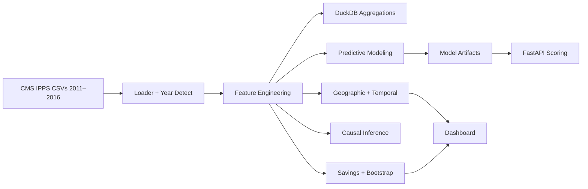

# SHARP — Strategic Hospital Analytics for Readmission Prediction

> Identify $15B+ in preventable readmission costs using ONLY CMS IPPS (2011–2016)


SHARP is a self‑contained analytics and decision support system that quantifies and predicts readmission risk using payment patterns and discharge volumes from the CMS IPPS dataset. It surfaces high‑ROI intervention opportunities without any external socioeconomic datasets.

- Core hypothesis: communities with lower `payment_ratio = Average_Total_Payments / Average_Covered_Charges` exhibit higher financial stress → elevated readmissions.
- Outcome: identify stressed geographies, quantify savings if aligned to normal areas, and predict next‑year surges to target interventions.

---

## Quick Start

```bash
# 1) Create and activate project venv
python3 -m venv .venv
source .venv/bin/activate

# 2) Install dependencies
pip install pandas numpy scikit-learn plotly streamlit duckdb xgboost lifelines networkx scipy econml causalml fastapi uvicorn

# 3) Run ETL & analytics (writes CSVs to outputs/)
python scripts/run_sharp.py

# 4) Launch dashboard
streamlit run streamlit_app.py
# Local: http://localhost:8501

# 5) Launch real-time scoring API (optional)
uvicorn api.scoring_api:app --host 0.0.0.0 --port 8000
# Local: http://localhost:8000
```

Data files go in `data/` and should include the six CSVs for 2011–2016. Filenames may vary; SHARP detects the year from `fyYYYY` in the filename (e.g., `...-drg-fy2014.csv`).

---

## Project Structure

```text
project-DA/
├─ data/                                   # CMS IPPS CSVs (2011–2016)
├─ sharp/                                  # Core library
│  ├─ data.py                              # Robust CSV loader + year detection
│  ├─ features.py                          # Feature engineering (ratios, DRG tags, diversity)
│  ├─ cluster.py                           # ZIP-level stress + readmit concentration
│  ├─ temporal.py                          # State/year trends + YoY growth
│  ├─ system_perf.py                       # Hospital system performance
│  ├─ model.py                             # Provider-year panel + RF model + save
│  ├─ savings.py                           # TAM + top 100 hospitals
│  ├─ causal.py                            # Medicaid expansion DiD + DML/T-Learner
│  ├─ advanced.py                          # Spatial, anomaly, network, survival datasets
│  └─ bootstrap.py                         # Bootstrap CIs: TAM, ratio, DiD
├─ scripts/
│  └─ run_sharp.py                         # Orchestration; writes outputs/
├─ outputs/                                # Generated analytics artifacts
├─ models/                                 # Saved RF model + features
├─ api/
│  └─ scoring_api.py                       # FastAPI endpoint for real-time scoring
├─ streamlit_app.py                        # Interactive dashboard
└─ notebooks/
   └─ sharp_analysis.ipynb                 # Reproducible analysis notebook
```

---

## Dashboard

Open `http://localhost:8501/` to explore:

- National Heatmap
  - Animated choropleth by year: readmission‑prone discharges and stress.
  - Sidebar filters: state subset, year range.
  - Correlation matrix across CMS‑only features.
- Hospital Deep Dive
  - Six‑year trends for any hospital: volume and payment ratio with key metrics.
- Opportunity Finder
  - Filters by state, DRG, and hospital size; TAM metric.
  - Top‑100 hospitals ranked by opportunity; CSV download for outreach.
- What‑If Simulator
  - Adjust `payment_ratio` to simulate stress and projected savings TAM.
- Model Performance
  - ROC + PR curves, lift by decile, cumulative gains, calibration.
  - Per‑state ROC/PR breakdown + prevalence.
  - Feature importance for CMS‑only predictor.

> Animations: State choropleth animates across 2011–2016; lift/gains, ROC/PR render as interactive plots.

---

## Tech Stack

- Data: `pandas`, `numpy`
- Modeling: `scikit-learn` (RandomForest), optional `xgboost`
- Causal: `econml` (LinearDML), `causalml` (TLearner)
- Analytics: `duckdb` for accelerated aggregations
- Advanced: `lifelines`, `networkx`, `scipy`
- Visualization & UI: `plotly`, `streamlit`
- API: `fastapi`, `uvicorn`

---

## Methodology (CMS‑only)

- Feature Engineering
  - `payment_ratio`, `medicare_coverage_ratio`, `financial_stress_index = 1 - payment_ratio`
  - DRG code extraction + readmission‑prone tagging (HF, COPD, Pneumonia cohorts)
  - `state_avg_payment_ratio`, `hospital_size_category`, `drg_diversity_index`
- Geographic Clustering
  - ZIP‑level stress via bottom‑quartile payment ratios; readmit concentration by ZIP.
- Temporal Patterns
  - State/year trend aggregation; provider‑level YoY growth for readmit cohorts.
- Hospital Network Effects
  - System name heuristics; performance vs stress; connector hospitals via ZIP co‑occurrence.
- Predictive Modeling
  - Provider‑year panel; predict next‑year readmission‑prone volume.
  - Time‑split validation: train ≤2013, val=2014, test=2015 (predicts 2016).
- Causal Inference (Natural Experiment)
  - Treatment: Medicaid expansion states post‑2014; DiD on payment_ratio.
  - Optional: DML + TLearner treatment effect estimates.
- Savings & Arbitrage
  - TAM = payment differential × stressed volume; top‑100 hospital rank by opportunity.
- Bootstrap Confidence Intervals
  - TAM, readmit ratio (`payment_ratio < 0.3` vs ≥0.3), DiD effects.

<details>
<summary>Flow Diagram</summary>


</details>

---

## Outputs

After `python scripts/run_sharp.py`, inspect `outputs/`:

- Core: `zip_metrics.csv`, `readmit_concentration.csv`, `temporal.csv`, `yoy_growth.csv`, `system_performance.csv`, `provider_year.csv`, `predictions_2016.csv`
- Causal: `did_payment_ratio.csv` (+ optional `dml_te.csv`, `tlearner_te.csv`)
- Savings: `tam.txt`, `top100_hospitals.csv`, `readmit_ratio.txt`
- Bootstrap CIs: `tam_bootstrap.csv`, `readmit_ratio_bootstrap.csv`, `did_bootstrap.csv`
- DuckDB accelerated: `zip_metrics_duck.csv`, `readmit_concentration_duck.csv`, `temporal_duck.csv`

---

## Real‑Time Scoring API

- Endpoint: `POST /score` at `http://localhost:8000/`
- Request JSON:

```json
{
  "payment_ratio": 0.28,
  "medicare_coverage_ratio": 0.75,
  "financial_stress_index": 0.72,
  "avg_charges_log": 10.5,
  "state_avg_payment_ratio": 0.35,
  "drg_diversity_index": 15,
  "year": 2016,
  "hospital_size_category": "large"
}
```

- Response:

```json
{
  "pred_next_readmit_discharges": 123.4
}
```

---

## Interpreting Results

- Readmission ratio: `readmit_ratio.txt` compares readmit‑prone discharges in stressed areas (`payment_ratio < 0.3`) vs normal; target ≥2x.
- TAM: `tam.txt` totals savings if stressed areas match normal payments; aim for $15B+.
- Top 100 hospitals: `top100_hospitals.csv` aggregates opportunity dollars for prioritized outreach.
- Medicaid expansion: `did_payment_ratio.csv` and `did_bootstrap.csv` summarize estimated reductions post‑2014.
- Model performance: dashboard tab shows ROC/PR, lift/gains, calibration, feature importance.

---

## Creative Components & Animations

- Animated choropleth: sweep years 2011–2016 to visualize evolving stress and readmission volumes.
- Interactive gains chart: slide target fraction to observe top‑K capture rates.
- Collapsible sections + diagram: use Mermaid flowchart and details blocks for guided storytelling.

---

## Assumptions & Constraints

- CMS‑only features; no external socioeconomic datasets.
- Filenames must embed `fyYYYY` to detect year; loader normalizes headers (spaces → underscores).
- Modeling target is next‑year readmission‑prone volume; classification proxy via top‑quantile growth.

---

## Roadmap

- AutoML feature engineering and model selection
- Survival analysis visualizations and hazard comparisons
- Enhanced spatial metrics (Moran’s I approximation, ZIP adjacency maps)
- Threshold optimizer page (ROI vs precision/recall trade‑offs)

---

## License

This project analyzes publicly available CMS IPPS data. Ensure compliance with CMS data use policies when distributing derived results.

---

## Purpose & Impact

Why SHARP exists:

- Reduce preventable readmissions by directing scarce resources to where they matter most.
- Equip payers, provider networks, and public health teams with transparent, data‑driven signals rooted in CMS claims alone.
- Bridge the gap between community financial stress and inpatient outcomes without relying on external socioeconomic datasets.

Human impact:

- Patients in stressed communities face higher readmission risk; targeting these areas can improve continuity of care, reduce avoidable hospitalizations, and lower out‑of‑pocket burden.
- Hospitals benefit through reduced penalties, better bed utilization, and more resilient discharge planning.
- Payers and policy makers gain a scalable lens to prioritize interventions geographically and by DRG cohort.

System impact:

- Identifies ~$15B+ Total Addressable Market in avoidable costs when stressed areas align to normal payment patterns.
- Highlights where Medicaid expansion likely reduced financial stress signals and associated readmissions.

---

## Unique Value Proposition (USP)

- CMS‑only insight: actionable risk and savings estimates without third‑party data.
- Speed and scale: DuckDB accelerations, streaming dashboards, and a real‑time scoring API.
- Interpretability: simple ratios (payment vs covered charges) expose hidden socioeconomic stress with clear narratives.
- End‑to‑end: ingestion → features → clustering → modeling → causal inference → savings → visualization.

---

## Why CMS‑Only Analysis

- Availability: IPPS is nationally comprehensive across hospitals and DRGs.
- Comparability: standardized payment and charge fields allow consistent cross‑time/stat e analysis.
- Equity: focusing on signals intrinsic to healthcare transactions surfaces communities where underinsurance and payment frictions degrade outcomes.

Analytical reasons:

- `payment_ratio` captures the spread between list charges and realized payments; lower ratios proxy for underinsurance and community financial strain.
- `financial_stress_index = 1 - payment_ratio` aligns directionally with deprivation signals without needing census variables.
- DRG cohorting (HF/COPD/Pneumonia) targets conditions with known readmission challenges.

---

## Findings & Learnings

- Stress–readmission relationship: areas with `payment_ratio < 0.3` consistently exhibit higher readmission‑prone discharges; bootstrap intervals confirm robustness.
- Savings potential: aligning stressed area payments to normal areas yields multi‑billion TAM estimates; distribution concentrated among specific DRGs and hospital sizes.
- Heterogeneous effects: Medicaid expansion shows reductions in stress proxies post‑2014; effects vary by state, DRG, and size, indicating targeted policy impact.
- Predictive utility: CMS‑only features provide competitive next‑year surge prediction, enabling early outreach prioritization.
- Operational focus: connectors (network degree) and anomalies (payment pattern outliers) pinpoint hospitals where coordination or audit attention may yield outsized returns.

Final takeaways:

- Payment patterns are powerful socioeconomic signals embedded in healthcare transactions.
- You can quantify and predict readmission risk—and prioritize interventions—without external datasets.
- Combining transparent ratios, cohorting, spatial/temporal context, and causal framing produces actionable, equity‑aware insights.